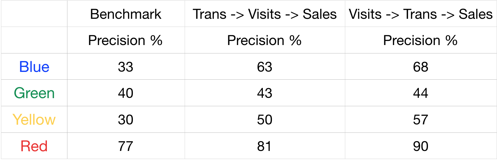

## Time Series Forecasting -- for Sales, Transactions, Visits

This capstone project is about forecasting sales for companies to make informed business decisions. For instance, if managers could have the projection of sales for the next two-weeks in advance, they would be able to properly allocate labor hours and identify the working efficiency of employees.


### Data Set

The dataset is provided by [BlueDay,Inc.](https://www.blueday.com)
It contains information about net sales, number of visitors to the store, labor hours, the units that have been sold at an hourly rate, employee skills, and sales goals for two years and more than 300 stores.

### Models 

#### 1. ARIMA -> Prophet
After exploring the dataset, I found that patterns of sales,transactions, and visits versus time are very different under various time periods. For example, peaks usually happen at weekends and holidays and minimums occur on weekdays. In order to catch these patterns, I first used a traditional time series model -- [ARIMA](https://en.wikipedia.org/wiki/Autoregressive_integrated_moving_average). It takes seasonality into account and the prediction result of a sample two-week period (on the left below) shows that although the seasonal pattern has been caught, the magnitude of the prediction still needs improvement. After further exploring the data, I found that on holidays, the magnitude of sales and visits usually have a sharp increase, which is not reflected in this model. So to count for the holiday effect, I applied package [Prophet](https://facebook.github.io/prophet/) and adding federal holidays and store special events calendar into the model. The prediction (on the right below) performs much better and RMSE has been decreased to $4,540 compared with a mean sales amount of $26,000.


#### 2. Prophet -> Prophet + AdaBoost
Instead of purely using time series data for sales, visits, and transactions themselves, I moved on to expand the model by integrating additional information, such as transactions goal, hours goal, and employee skill levels. 

For example, to make projection for sales, I first used training set to find the relation between feature variables and sales using [AdaBoost](https://en.wikipedia.org/wiki/AdaBoost), an ensemble method in Machine Learning. Then, for features without 'Goal' in their variable names, I use Prophet to make two-week projections for them parallelly; for those feature variables which are labeled as 'Goal', I used acutal numbers instead of predicted ones because they are already known two weeks in advance. The last step was applying learned model to the projection period of all feature variables so that we can get the corresponding projected sales. The performance below shows that prophet integrated with machine learning model works even better in terms of RMSE and R^2. 


#### 3. Find Best Prediction Path
In previous models, I predicted transactions and visits independently when using them for sales projection. Instead of predicting them parallelly, it would also be interesting to investigate whether there could be a sequential effect on the order of predicting transactions and visits. So the following are two paths that I have tried in sales projection:
- Path 1: Transactions —> Visits —> Sales

```
          - Step 1: Predict Transations
            Input Variables: Trans_Goal, Hours_Goal, AVG_TPH, AVG_DPT
            Output Variable: Pred_Trans
          - Step 2: Predict Visits
            Input Variables:  Pred_Trans, Unit, Visit_Goal
            Output Variable: Pred_Visits
          - Step 3: Predict Sales
            Input Variables: Pred_Visits, Net_Sales_Goal
            Output Variable: Pred_Net_Sales
```

- Path 2: Visits —> Transactions —> Sales

```                 
          - Step 1: Predict Visits
            Input Variables: Unit, Visit_Goal
            Output Variable: Pred_Visits
          - Step 2: Predict Transactions
            Input Variables:  Pred_Visits, Trans_Goal, Hours_Goal, AVG_TPH, AVG_DPT
            Output Variable: Pred_Trans
          - Step 3: Predict Sales
            Input Variables: Pred_Trans, Net_Sales_Goal
            Output Variable: Pred_Net_Sales

```
_For each step in both paths, I used Prophet + AdaBoost model mentioned above to get the corresponding output variable._

The projection R^2 and RMSE of two paths are about the same. 

### Model Evaluation based on Color Projection
In the analytics platform provided by BlueDay, they use color scheme to tell managers whether their sales goal for the next two weeks is above, within, or below the predicted sales. The color scheme they use is: 

```
          - Blue if > 10% above goal
          - Green if between 0 and 10% above goal
          - Yellow if between -10% and 0% below goal 
          - Red if -10% or more below goal.
```

Projected days are colored based on Projected vs. Goal and Actual days are colored based on Actual vs. Goal. 

Under this scheme, I also evaluated models for two paths based on whether it projected the correct color.
The performances are summarized below:

_Benchmark case: only use Prophet to predict sales_

The second path: Visits -> Transactions -> Sales works better in all colors than the other path.

### Sample Projections for Sales, Transactions, and Visits
Based on the performance, I choose the Prophet + AdaBoost model and the Visits -> Transactions -> Sales to get the projections for sales, transactions, and visits.
[Here is the app](http://time-series-sample-projections.herokuapp.com/) to see sample projections on different dates, which includes prediction periods with or without national holidays and the prediction period where maximum amount of sales happens.

This is the end of my capstone project. Thanks for reviewing!
