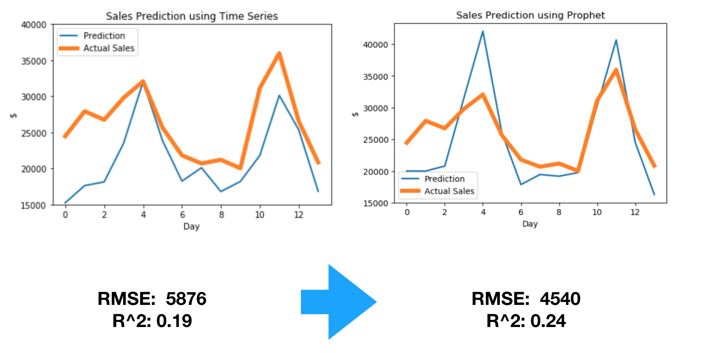
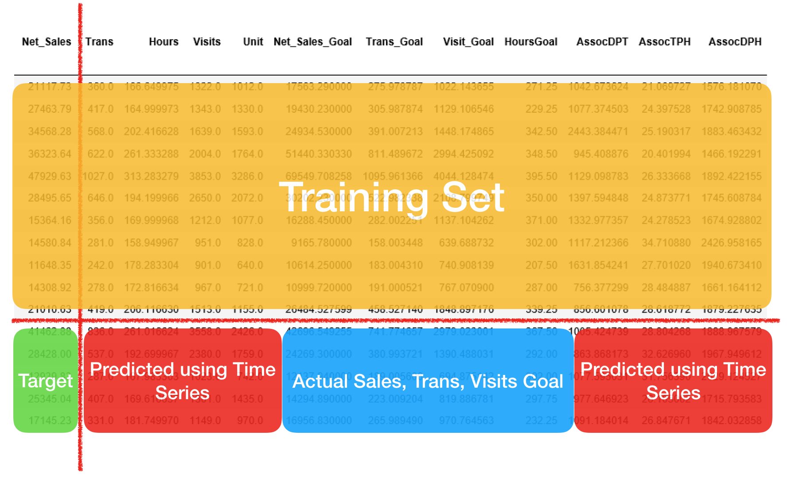
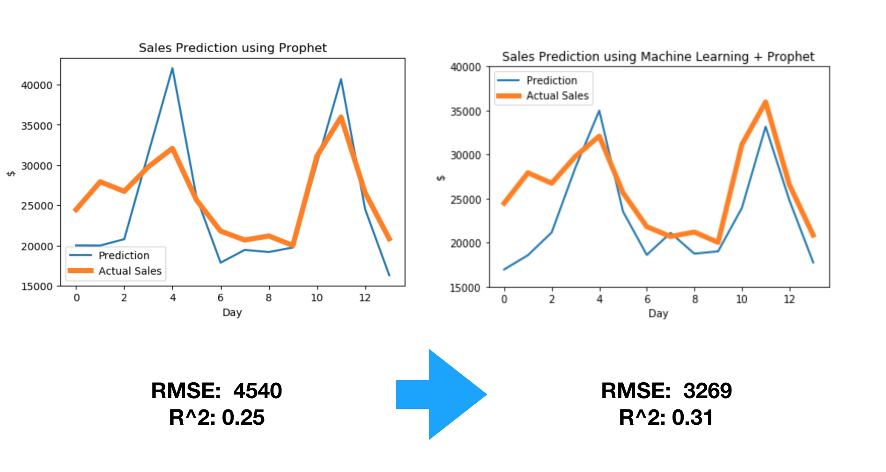

## Time Series Forecasting -- for Sales, Transactions, Visits

This capstone project is about forecasting sales for companies to make informed business decisions. For instance, if managers could have the projection of sales for the next two-weeks in advance, they would be able to properly allocate labor hours and identify the working efficiency of employees.


### Data Set

The dataset is provided by [BlueDay,Inc.](https://www.blueday.com)
It contains information about net sales, number of visitors to the store, labor hours, the units that have been sold at an hourly rate, employee skills, and sales goals for two years and more than 300 stores.

### Models 

#### 1. ARIMA -> Prophet
After exploring the dataset, I found that patterns of sales,transactions, and visits versus time are very different under various time periods. For example, peaks usually happen at weekends and holidays and minimums occur on weekdays. In order to catch these patterns, I first used a traditional time series model -- [ARIMA](https://en.wikipedia.org/wiki/Autoregressive_integrated_moving_average). It takes seasonality into account and the prediction result of a sample two-week period (on the left below) shows that although the seasonal pattern has been caught, the magnitude of the prediction still needs improvement. After further exploring the data, I found that on holidays, the magnitude of sales and visits usually have a sharp increase, which is not reflected in this model. So to count for the holiday effect, I applied package [Prophet](https://facebook.github.io/prophet/) and adding federal holidays and store special events calendar into the model. The prediction (on the right below) performs much better and RMSE has been decreased to $4,540 compared with a mean sales amount of $26,000.



#### 2. Prophet -> Prophet + AdaBoost
Instead of purely using time series data for sales, visits, and transactions themselves, I moved on to expand the model by integrating additional information, such as transactions goal, hours goal, and employee skill levels. 

For example, to make projection for sales, I first used training set to find the relation between feature variables and sales using [AdaBoost](https://en.wikipedia.org/wiki/AdaBoost), an ensemble method in Machine Learning. Then, for features without 'Goal' in their variable names, I use Prophet to make two-week projections for them parallelly; for those feature variables which are labeled as 'Goal', I used acutal numbers instead of predicted ones because they are already known two weeks in advance. The last step was applying learned model to the projection period of all feature variables so that we can get the corresponding projected sales. The performance below shows that prophet integrated with machine learning model works even better in terms of RMSE and R^2. 


#### 3. Find Best Prediction Path
In previous models, I predicted transactions and visits independently when using them for sales projection. Instead of predicting them parallelly, it would also be interesting to investigate whether there could be a sequential effect on the order of predicting transactions and visits. 

- Path 1
- Path 2


```markdown
Syntax highlighted code block


# Header 1 
## Header 2
### Header 3

- Bulleted
- List

1. Numbered
2. List

**Bold** and _Italic_ and `Code` text

[Link](https://github.com/Gracecjy/BlueDay/blob/master/1.png) and 

```

For more details see [GitHub Flavored Markdown](https://guides.github.com/features/mastering-markdown/).

### Jekyll Themes

Your Pages site will use the layout and styles from the Jekyll theme you have selected in your [repository settings](https://github.com/Gracecjy/BlueDay/settings). The name of this theme is saved in the Jekyll `_config.yml` configuration file.

### Support or Contact

Having trouble with Pages? Check out our [documentation](https://help.github.com/categories/github-pages-basics/) or [contact support](https://github.com/contact) and we’ll help you sort it out.
